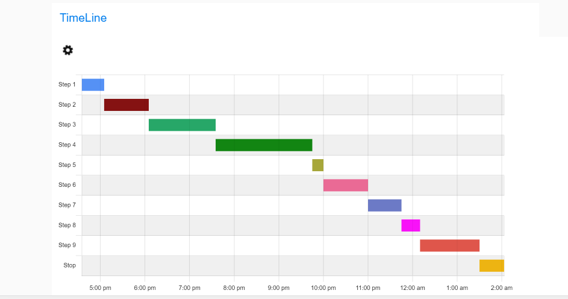

# node-red-contrib-ui-timeline

A Node-RED-Dashboard UI widget node that displays timeline. Google-like timeline chart based on Chart.js.

## Install

Either use the Editor - Menu - Manage Palette - Install option, or run the following command in your Node-RED user directory (typically `~/.node-red`) after installing Node-RED-dashboard.

        npm i node-red-contrib-ui-timeline
        npm i https://github.com/PO-CES-EDGE/node-red-contrib-ui-timeline

## Usage



This timeline node expects `msg.payload` to contain an array of array of  timeline data, one object per row.
Each data row object should have the same set of values:

- Label
- Start date timestamp
- End date timestamp


### Example data

```
[
  [
    "Start Extruders",
    1619861576130,
    1619866976130
  ],
  [
    "Raise to starting speeds",
    1619866976130,
    1619868476130
  ],
  [
    "Raise to starting speeds",
    1619868476130,
    1619870276130
  ],

  [
    "Stop",
    1619900816130,
    1619902076130
  ]
]
```


### Outputs 

(No output)

## advanced features

### Validation

Input data into message payload must be an array of array of 3 items <code>[[String, date timestamp, date timestamp], ....]
Example of JavaScript validation with:

    const dataSchema =  Joi.array().items(stepSchema).required();
    const stepSchema = Joi.array().length(3).items(Joi.string().required(), Joi.date().timestamp().required(), Joi.date().timestamp().required());
    

### Configuration


The configuration is used to change how the timeline behaves. There are properties to control styling, fonts, the legend, etc.

| Configuration key                                    | Description                                                  |
| ---------------------------------------------------- | ------------------------------------------------------------ |
| Display label                                        | Display label of each element                                |
| Enable responsive                                    | Enable responsive design: Resizes the chart canvas when its container does. |
| Text padding                                         | Label padding space                                          |
| **Y-axis configuration**                             |                                                              |
| Background colors                                    | Choose two colors for y-axis grid background color           |
| Repeat two colors                                    | Repeat two background colors on y-axis grid.                 |
| **Elements or steps background color configuration** |                                                              |
| Palette 1                                            | Choose palette 1 colors                                      |
| Palette 2                                            | Choose palette 2 colors                                      |

